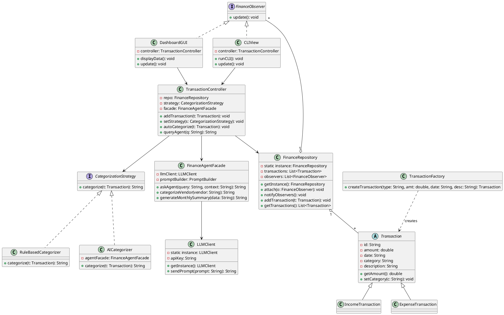
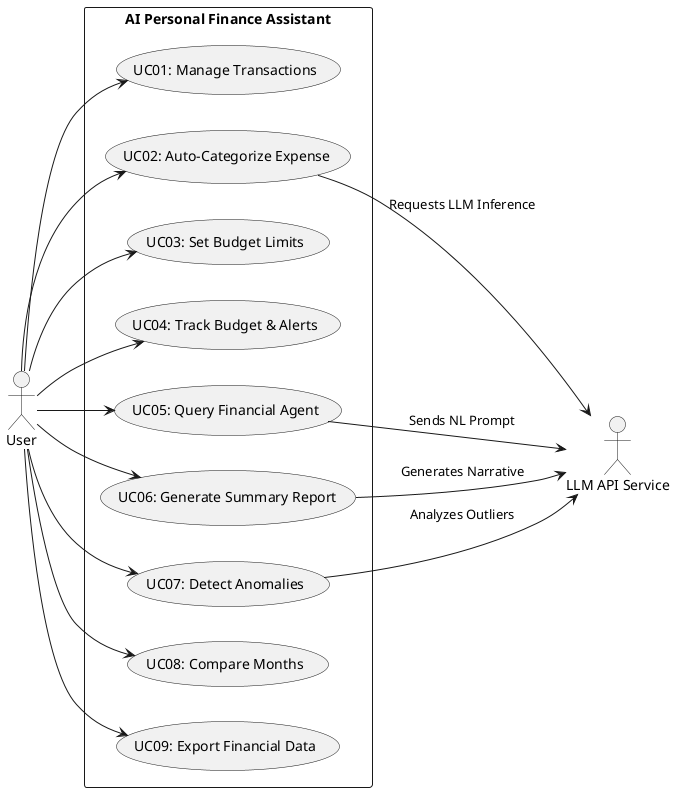
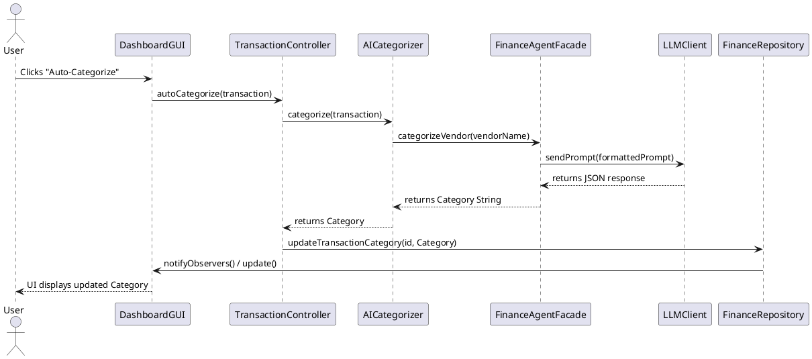
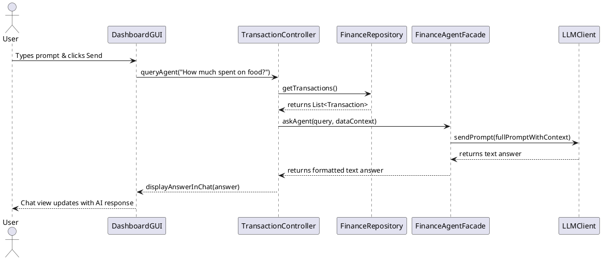

---

# Stage 1 Report: AI Personal Finance Assistant

## 1. Project Overview

### 1.1 Problem & Motivation

Personal financial management is often tedious and overwhelming for individuals who struggle with manual expense tracking, multi-category budgeting, and interpreting complex financial data. Traditional finance applications require manual input and offer static charts without actionable context. The **AI Personal Finance Assistant** solves this by combining automated transaction processing with an intelligent conversational agent that provides natural-language financial advice, anomaly detection, and automated categorization.

### 1.2 Target Users

* **Students & Young Professionals:** Need simple automated budget tracking and clear financial advice.
* **Casual Users:** Want quick answers about their spending habits without navigating complex financial reports.

### 1.3 Agent Description & AI Model

The AI agent serves as an intelligent financial advisor and data processor. It does not merely answer static questions; it autonomously inspects user spending data, detects anomalies, dynamically suggests category classifications based on vendor names, and generates context-aware savings strategies.

* **AI/LLM Model:** OpenAI GPT-4o-mini (or Ollama Llama-3 locally for offline development).
* **System Integration:** The core application passes structured JSON payloads containing recent transactions and user query strings to `LLMClient`. The model responds with JSON-formatted structural outputs or conversational advice parsed directly by `FinanceAgentFacade`.

### 1.4 Architecture Summary

The system follows a Model-View-Controller (MVC) architecture integrated with a Facade for the AI engine. Both Graphical User Interface (GUI) and Command-Line Interface (CLI) components interact with the system through controller objects, keeping business logic and AI processing strictly decoupled from presentation layer components.

---

## 2. Feature Specification

### F01: Transaction Entry & Management

* **Description:** Allows users to manually add, edit, or delete income and expense records.

* **User Interaction (GUI):** Form with Date, Amount, Vendor, Category dropdown, and Type (Income/Expense), with an "Add Transaction" button.
* **Input:** Amount (double), Date (String), Vendor (String), Category (String), Type (Enum).

* **Output:** Updated transaction list displayed in UI table.

* **AI Involvement:** Deterministic.

* **Expected Workflow:** User fills form fields -> Clicks "Add" -> `TransactionController` validates input -> Adds transaction to `FinanceRepository` -> Table view updates.

* **Error/Alternative Cases:** Invalid numeric amount or empty mandatory fields display an inline error message box.

### F02: Automated AI Transaction Categorization

* **Description:** Uses LLM reasoning to infer transaction categories based on vendor descriptions when unassigned.

* **User Interaction (GUI):** Click "Auto-Categorize Unassigned" button on the transaction panel.
* **Input:** Uncategorized transaction vendor string and description.
* **Output:** Assigned category string (e.g., "Dining", "Utilities").
* **AI Involvement:** AI-Based.

* **Expected Workflow:** User triggers button -> Controller retrieves uncategorized items -> Sends prompt to `LLMClient` -> Agent returns predicted categories -> Repository updates items.
* **Error/Alternative Cases:** Network timeout or API failure falls back to default "Uncategorized" category.

### F03: Monthly Budget Setting & Allocation

* **Description:** Allows users to define monthly budget thresholds per expense category.

* **User Interaction (GUI):** Category budget configuration tab with editable numeric fields per category.
* **Input:** Category Name, Target Budget Limit ($).
* **Output:** Confirmation message and updated progress bars indicating budget thresholds.
* **AI Involvement:** Deterministic.

* **Expected Workflow:** User inputs limits -> Clicks "Save Budgets" -> `BudgetManager` updates limit mappings -> UI refreshes limit markers.
* **Error/Alternative Cases:** Negative budget limit inputs trigger a validation toast warning.

### F04: Real-time Budget Tracking & Alerting

* **Description:** Monitors spending against set budgets and raises warning alerts when thresholds (e.g., 85%, 100%) are breached.

* **User Interaction (GUI):** Banner alerts on top dashboard and highlighted red rows in category tables.
* **Input:** Total monthly spending per category vs. spending limits.

* **Output:** Status flag (OK, Warning, Exceeded) and warning banner messages.

* **AI Involvement:** Deterministic.

* **Expected Workflow:** Adding/updating transaction triggers budget check -> `BudgetManager` evaluates spent ratio -> If ratio >= limit, notifies active UI view to display alert banner.

* **Error/Alternative Cases:** No budgets defined -> Alerts remain disabled.

### F05: Natural Language Financial Q&A

* **Description:** Users ask plain-text questions about their financial history and receive contextual responses.

* **User Interaction (GUI):** AI Chat window with prompt input field and conversation history area.
* **Input:** User query (e.g., "How much did I spend on food last month?").
* **Output:** Text explanation summarizing relevant financial records.

* **AI Involvement:** AI-based.

* **Expected Workflow:** User inputs question -> `AgentController` fetches context from `FinanceRepository` -> Formats prompt for `LLMClient` -> Agent parses context and returns natural-language answer -> Appended to chat window.
* **Error/Alternative Cases:** Empty database or no matching transactions -> Agent responds that no relevant financial record was found.

### F06: Automated Monthly Financial Summary

* **Description:** Generates an executive summary highlighting spending, top categories, and income vs. expense balance.

* **User Interaction (GUI):** "Generate Monthly Summary" button on Dashboard tab.
* **Input:** Target Month/Year selection.
* **Output:** Formatted rich text summary report.

* **AI Involvement:** AI-based.

* **Expected Workflow:** User selects month and triggers button -> Controller aggregates month totals -> `FinanceAgentFacade` passes raw metrics to LLM -> LLM returns executive narrative report -> Displayed in summary modal.

* **Error/Alternative Cases:** Selected month has zero transactions -> System outputs static text: "No data recorded for this period."

### F07: Unusual Expense Anomaly Detection

* **Description:** Scans recent transactions to detect unusual outlier purchases based on historical spending averages.

* **User Interaction (GUI):** "Scan for Anomalies" button or auto-run upon opening dashboard.
* **Input:** Historical average transaction size vs. new transaction amounts.

* **Output:** List of flagged suspicious/unusual transactions with explanations.

* **AI Involvement:** Hybrid (Statistical threshold calculation + AI explanation).

* **Expected Workflow:** System calculates Z-score for spending -> Outliers are sent to LLM to evaluate rationale based on vendor name -> Flags displayed in Anomaly Panel.
* **Error/Alternative Cases:** Insufficient historical data (<5 transactions) -> Action skipped with notification "More spending history required."

### F08: Month-over-Month Spending Comparison

* **Description:** Compares total and category-wise expenditure between two selected calendar months.

* **User Interaction (GUI):** Comparison view with month dropdown selectors and variance table.
* **Input:** Month A, Month B.
* **Output:** Tabular comparison of totals, percentage change, and AI insight notes.
* **AI Involvement:** Hybrid.

* **Expected Workflow:** User picks two months -> Controller computes numeric differences -> LLM generates key takeaways regarding trends -> Displayed in comparison dashboard.
* **Error/Alternative Cases:** Identical month selected -> System alerts user to choose distinct months.

### F09: Personalized Savings Advice Generation

* **Description:** Analyzes recurring spending and suggests specific actionable steps to reduce unnecessary costs.

* **User Interaction (GUI):** "Get Saving Recommendations" button in Insights tab.
* **Input:** Category totals, recurring subscriptions list.

* **Output:** Bulleted list of actionable personalized saving advice items.

* **AI Involvement:** AI-Based.

* **Expected Workflow:** User requests advice -> Controller extracts non-essential spending data -> Passes profile to LLM -> LLM generates tailored advice list -> Rendered in Insights view.
* **Error/Alternative Cases:** Model timeout -> Display fallback rules (e.g., "Try reducing highest category expense by 10%").

### F10: Financial Data Export

* **Description:** Exports spending reports, transaction histories, and AI summaries into standard CSV or JSON files.

* **User Interaction (GUI):** File Menu -> Export Data -> Select CSV or JSON.
* **Input:** File destination path, format choice, date range.
* **Output:** Saved file on local filesystem.

* **AI Involvement:** Deterministic.

* **Expected Workflow:** User selects export options -> `ExportManager` converts `FinanceRepository` collections into string format -> Writes to disk -> Shows completion dialog.
* **Error/Alternative Cases:** Permission error writing file -> Displays error popup asking for alternative save path.

---

## 3. System Architecture & Design Patterns

### 3.1 Design Pattern Explanations

1. **Strategy Pattern**
* **Problem Addressed:** Allows switching dynamically between different transaction categorization algorithms (Rule-Based vs. AI LLM-Based) without modifying client code.

* **Participating Classes:** `CategorizationStrategy` (Interface), `RuleBasedCategorizer` (Concrete Strategy), `AICategorizer` (Concrete Strategy), `TransactionController` (Context).

* **Role:** Context holds a reference to `CategorizationStrategy` and executes categorization dynamically.
* **Rationale:** Provides flexibility to fall back to rule-based logic when offline or low-latency operations are needed.
* **Without Pattern:** `TransactionController` would contain cluttered `if-else` blocks checking system state, violating the Open-Closed Principle.

2. **Observer Pattern**
* **Problem Addressed:** Decouples user interfaces (GUI and CLI) from the core data model, ensuring UI views automatically refresh when transaction or budget data updates.

* **Participating Classes:** `Subject` (Interface), `FinanceRepository` (Concrete Subject), `FinanceObserver` (Observer Interface), `DashboardGUI` (Concrete Observer), `CLIView` (Concrete Observer).

* **Role:** `FinanceRepository` notifies registered observers whenever records are added, modified, or removed.
* **Rationale:** Keeps GUI and CLI synchronized with data modifications seamlessly.

* **Without Pattern:** Controller logic would require hardcoded references to every UI view to force explicit re-renders.

3. **Factory Method Pattern**
* **Problem Addressed:** Encapsulates the instantiation logic for various transaction types (e.g., Income, Expense, Recurring Expense).

* **Participating Classes:** `TransactionFactory` (Creator), `Transaction` (Abstract Product), `IncomeTransaction` (Concrete Product), `ExpenseTransaction` (Concrete Product).

* **Role:** Instantiates and initializes appropriate subclass objects based on raw input parameters.
* **Rationale:** Centralizes data instantiation and validation logic.
* **Without Pattern:** Calling constructors directly across controllers creates duplication and rigid coupling.

4. **Facade Pattern**
* **Problem Addressed:** Hides the complexity of coordinating LLM prompt formatting, API invocation, response parsing, and error fallback from client components.

* **Participating Classes:** `FinanceAgentFacade` (Facade), `LLMClient`, `AnalyticsEngine`, `PromptBuilder`.

* **Role:** Exposes high-level simple methods like `askAgent(query)` or `generateSummary(month)` to UI controllers.

* **Rationale:** Simplifies caller interfaces and isolates AI sub-system updates to a single boundary.
* **Without Pattern:** Controllers would directly construct raw prompt strings, handle HTTP status codes, and manually parse JSON strings from the LLM.

5. **Singleton Pattern**
* **Problem Addressed:** Ensures only one instance of `LLMClient` and `FinanceRepository` exists in memory to prevent duplicate API client setups and conflicting data state.

* **Participating Classes:** `LLMClient` (Singleton), `FinanceRepository` (Singleton).

* **Role:** Provides thread-safe global point of access via a `getInstance()` method.
* **Rationale:** Prevents unnecessary network resources instantiation and guarantees single source of truth for runtime data.
* **Without Pattern:** Multiple instances could cause data inconsistency or redundant API authentication connections.

---

### 3.2 UML Class Diagram (PlantUML)

---

## 4. Use Case Specifications & Diagram

### 4.1 Use Case Diagram (PlantUML)

### 4.2 Detailed Use Case Descriptions

#### UC01: Manage Transactions

* **Actor:** Primary User

* **Goal:** Add, edit, or remove spending and income records.

* **Preconditions:** System is running; repository initialized.
* **Trigger:** User selects "Add Transaction" in GUI or enters command in CLI.

* **Main Success Scenario:**
1. User inputs transaction parameters (Amount, Vendor, Date, Type).

2. System validates input data formats.

3. `TransactionFactory` creates `Transaction` object.

4. `FinanceRepository` saves transaction and notifies observers.

5. UI updates table display.

* **Alternative/Exception Flows:**
* 2a. Invalid numeric amount -> System highlights field and halts save process.

* **Postconditions:** Data store reflects added/edited record.

* **Related Feature:** F01

#### UC02: Auto-Categorize Expense

* **Actor:** Primary User, LLM API Service

* **Goal:** Automatically predict expense category using LLM.

* **Preconditions:** Transaction exists without category.

* **Trigger:** User clicks "Auto-Categorize" button.

* **Main Success Scenario:**
1. System extracts uncategorized transaction descriptions.

2. `AICategorizer` passes request to `FinanceAgentFacade`.

3. Facade calls `LLMClient` with prompt.

4. LLM returns predicted category string.

5. System sets transaction category and updates view.

* **Alternative/Exception Flows:**
* 3a. Network connection down -> Strategy falls back to `RuleBasedCategorizer` and assigns default category.

* **Postconditions:** Category attribute is populated on transaction record.

* **Related Feature:** F02

#### UC05: Query Financial Agent

* **Actor:** Primary User, LLM API Service

* **Goal:** Get natural language answers about spending history.

* **Preconditions:** Transactions exist in system.
* **Trigger:** User submits question in AI chat input.
* **Main Success Scenario:**
1. User inputs query string.
2. `TransactionController` fetches spending history summary.
3. System sends context + query to `FinanceAgentFacade`.
4. Agent generates conversational response string.
5. Response displays in chat window.

* **Alternative/Exception Flows:**
* 3a. LLM returns error code -> System outputs "Agent unavailable, try again later."

* **Postconditions:** Conversation log is updated.
* **Related Feature:** F05

---

## 5. Sequence Diagrams

### SD01: Auto-Categorize Transaction (F02 / UC02)

### SD02: Natural Language Query Processing (F05 / UC05)

---

## 6. Feature-to-Design Traceability Table

| Feature ID & Name | Description | Type | Related UC | Classes Involved | Key Methods | Sequence Diagram | Design Pattern(s) |
| --- | --- | --- | --- | --- | --- | --- | --- |
| **F01**: Transaction Entry | Create/Edit/Delete Transactions | Deterministic | UC01 | `DashboardGUI`, `TransactionController`, `TransactionFactory`, `FinanceRepository` | `addTransaction()`, `createTransaction()`, `notifyObservers()` | SD01 | Observer, Factory Method |
| **F02**: Auto-Categorization | Infer category via LLM | AI-Based | UC02 | `DashboardGUI`, `TransactionController`, `CategorizationStrategy`, `AICategorizer`, `FinanceAgentFacade`, `LLMClient` | `categorize()`, `categorizeVendor()`, `sendPrompt()` | SD01 | Strategy, Facade, Singleton |
| **F03**: Budget Setting | Define budget limits per category | Deterministic | UC03 | `DashboardGUI`, `BudgetManager`, `FinanceRepository` | `setBudget()`, `getBudget()` | SD01 | Observer |
| **F04**: Budget Tracking | Real-time budget threshold alerts | Deterministic | UC04 | `BudgetManager`, `FinanceRepository`, `DashboardGUI`, `CLIView` | `checkThresholds()`, `update()` | SD01 | Observer |
| **F05**: Natural Language Q&A | Chatbot spending inquiries | AI-Based | UC05 | `DashboardGUI`, `TransactionController`, `FinanceAgentFacade`, `LLMClient`, `FinanceRepository` | `queryAgent()`, `askAgent()`, `sendPrompt()` | SD02 | Facade, Singleton |
| **F06**: Monthly Summary | Narrative financial summary report | AI-Based | UC06 | `DashboardGUI`, `TransactionController`, `FinanceAgentFacade`, `LLMClient` | `generateMonthlySummary()`, `sendPrompt()` | SD02 | Facade, Singleton |
| **F07**: Anomaly Detection | Detect statistical spending outliers | Hybrid | UC07 | `AnalyticsEngine`, `TransactionController`, `FinanceAgentFacade`, `LLMClient` | `detectOutliers()`, `askAgent()` | SD02 | Facade |
| **F08**: Month Comparison | Compare spending across months | Hybrid | UC08 | `AnalyticsEngine`, `DashboardGUI`, `FinanceAgentFacade` | `compareMonths()`, `askAgent()` | SD02 | Facade |
| **F09**: Savings Advice | Tailored cost-cutting recommendations | AI-Based | UC09 | `DashboardGUI`, `FinanceAgentFacade`, `LLMClient` | `generateAdvice()`, `sendPrompt()` | SD02 | Facade, Singleton |
| **F10**: Data Export | Export data to CSV/JSON | Deterministic | UC09 | `ExportManager`, `FinanceRepository`, `DashboardGUI` | `exportCSV()`, `exportJSON()` | SD01 | Singleton |

---

## 7. Feature Implementation Explanations

### F01 - Transaction Entry & Management

* **Related Use Case:** UC01 | **Related Sequence Diagram:** SD01
* **Classes Involved:** `DashboardGUI`, `TransactionController`, `TransactionFactory`, `FinanceRepository`, `ExpenseTransaction`.
* **Important Methods:** `DashboardGUI.onAddClicked()`, `TransactionController.addTransaction()`, `TransactionFactory.createTransaction()`, `FinanceRepository.addTransaction()`.
* **Execution:** When user clicks "Add", `DashboardGUI` passes form values to `TransactionController`. The controller uses `TransactionFactory` to instantiate an `ExpenseTransaction` or `IncomeTransaction`. The object is saved to `FinanceRepository`, which notifies observers to re-render tables.

### F02 - Automated AI Transaction Categorization

* **Related Use Case:** UC02 | **Related Sequence Diagram:** SD01
* **Classes Involved:** `DashboardGUI`, `TransactionController`, `AICategorizer`, `FinanceAgentFacade`, `LLMClient`, `FinanceRepository`.
* **Important Methods:** `TransactionController.autoCategorize()`, `AICategorizer.categorize()`, `FinanceAgentFacade.categorizeVendor()`, `LLMClient.sendPrompt()`.
* **Execution:** User triggers auto-categorize in GUI. Controller invokes `CategorizationStrategy` set to `AICategorizer`. `AICategorizer` calls `FinanceAgentFacade.categorizeVendor()`, which uses `LLMClient` to invoke the OpenAI model. The returned string category updates the transaction in `FinanceRepository`.

### F03 - Monthly Budget Setting & Allocation

* **Related Use Case:** UC03 | **Related Sequence Diagram:** SD01
* **Classes Involved:** `DashboardGUI`, `BudgetManager`, `FinanceRepository`.
* **Important Methods:** `DashboardGUI.saveBudget()`, `BudgetManager.setLimit()`.
* **Execution:** User inputs category numerical limits and clicks save. `BudgetManager` updates its mapping table and calls `FinanceRepository.notifyObservers()` to re-draw budget progress bars in UI.

### F04 - Real-time Budget Tracking & Alerting

* **Related Use Case:** UC04 | **Related Sequence Diagram:** SD01
* **Classes Involved:** `BudgetManager`, `FinanceRepository`, `DashboardGUI`, `CLIView`.
* **Important Methods:** `BudgetManager.checkThresholds()`, `FinanceObserver.update()`.
* **Execution:** Any transaction insert/update calls `checkThresholds()`. If total category expenses exceed 85% or 100%, an alert flag triggers `notifyObservers()`, displaying warning alerts on both GUI and CLI.

### F05 - Natural Language Financial Q&A

* **Related Use Case:** UC05 | **Related Sequence Diagram:** SD02
* **Classes Involved:** `DashboardGUI`, `TransactionController`, `FinanceRepository`, `FinanceAgentFacade`, `LLMClient`.
* **Important Methods:** `TransactionController.queryAgent()`, `FinanceAgentFacade.askAgent()`, `LLMClient.sendPrompt()`.
* **Execution:** User types question in chat bar. `TransactionController` pulls current user transaction records from `FinanceRepository`, bundles query + records context, and passes it to `FinanceAgentFacade`. The Facade queries `LLMClient` and renders the response text in the GUI chat box.

### F06 - Automated Monthly Financial Summary

* **Related Use Case:** UC06 | **Related Sequence Diagram:** SD02
* **Classes Involved:** `DashboardGUI`, `TransactionController`, `FinanceAgentFacade`, `LLMClient`.
* **Important Methods:** `TransactionController.generateMonthlySummary()`, `FinanceAgentFacade.generateMonthlySummary()`.
* **Execution:** User clicks "Generate Summary" for selected month. `TransactionController` aggregates raw totals, passes summary parameters to `FinanceAgentFacade`, which asks LLM to format a structured executive narrative displayed in a modal view.

### F07 - Unusual Expense Anomaly Detection

* **Related Use Case:** UC07 | **Related Sequence Diagram:** SD02
* **Classes Involved:** `AnalyticsEngine`, `TransactionController`, `FinanceAgentFacade`.
* **Important Methods:** `AnalyticsEngine.detectOutliers()`, `FinanceAgentFacade.askAgent()`.
* **Execution:** System calculates spending mean and standard deviations. Purchases exceeding threshold Z-scores are forwarded to `FinanceAgentFacade` to generate human-readable warning explanations (e.g., "Unusual 500$ charge at TechStore").

### F08 - Month-over-Month Spending Comparison

* **Related Use Case:** UC08 | **Related Sequence Diagram:** SD02
* **Classes Involved:** `AnalyticsEngine`, `DashboardGUI`, `FinanceAgentFacade`.
* **Important Methods:** `AnalyticsEngine.compareMonths()`, `FinanceAgentFacade.askAgent()`.
* **Execution:** User selects two months. `AnalyticsEngine` computes delta totals and passes variance data to `FinanceAgentFacade`, which provides insight comments on spending increases/decreases.

### F09 - Personalized Savings Advice Generation

* **Related Use Case:** UC09 | **Related Sequence Diagram:** SD02
* **Classes Involved:** `DashboardGUI`, `FinanceAgentFacade`, `LLMClient`.
* **Important Methods:** `FinanceAgentFacade.generateAdvice()`, `LLMClient.sendPrompt()`.
* **Execution:** User clicks "Get Advice". `FinanceAgentFacade` extracts high-spending categories from repository and sends a specialized prompt to `LLMClient` to generate cost-reduction recommendations.

### F10 - Financial Data Export

* **Related Use Case:** UC09 | **Related Sequence Diagram:** SD01
* **Classes Involved:** `ExportManager`, `FinanceRepository`, `DashboardGUI`.
* **Important Methods:** `ExportManager.exportCSV()`, `ExportManager.exportJSON()`.
* **Execution:** User triggers export menu option. `ExportManager` reads all transaction collections from `FinanceRepository`, formats records into CSV/JSON text streams, and writes output directly to chosen disk location.

---
